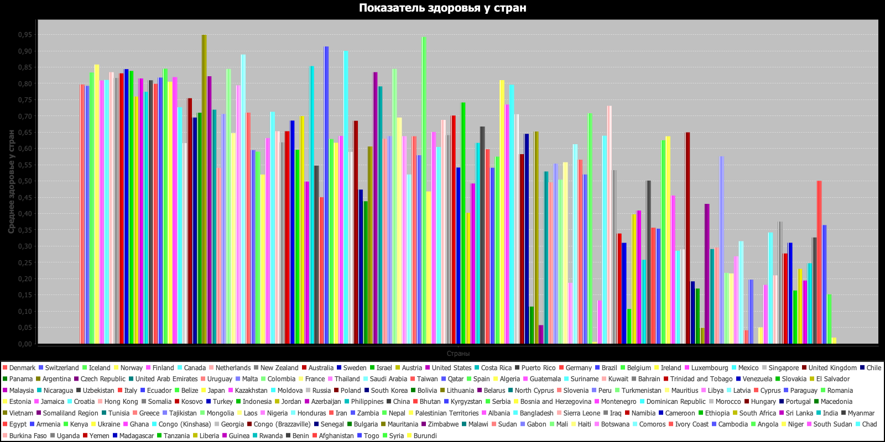

1. Выбрала свой вариант (7 вариант).

2. Разработала набор классов с необходимым составом полей 
и методов для хранения и обработки всех данных, хранящихся в CSV-файле "Показатель счастья по странам 2017.csv".

3. Распарсив данные в файле CSV, по ним создала набор объектов, заполнив все необходимые поля.

4. Создала файл БД SQL Lite и подключила ее к проекту.

5. В БД создала набор таблиц (по 3-ей нормальной форме) согласно набору объектов.

6. Все данные из набора объектов сохранила в БД.

7. Сделала набор SQL-запросов к БД согласно своему варианту задания.

8. Полученные данные вывела в текстовом виде в консоль, сделала скриншоты всех полученных данных.

9. Числовые данные по заданию визуализировала в виде диаграмм, сделала скриншоты всех полученных данных.

10. Для проекта создала открытый репозиторий на github и закоммитила туда всю работу по проекту.

11. В файле README описала последовательность работы по своему проекту, а также прикрепила все скриншоты.

Скриншот 1ого задания:

Скриншот 2ого задания:

Скриншот 3го задания:

